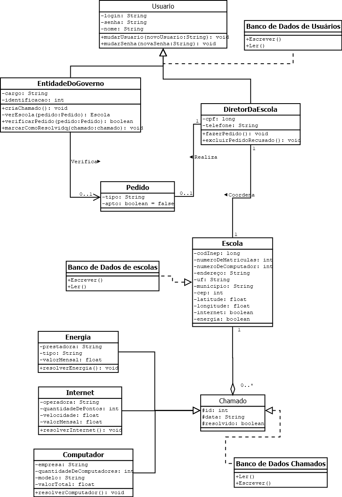
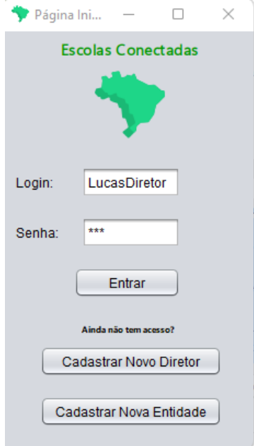
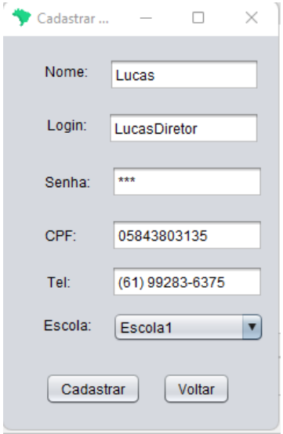
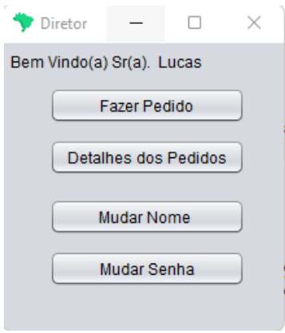
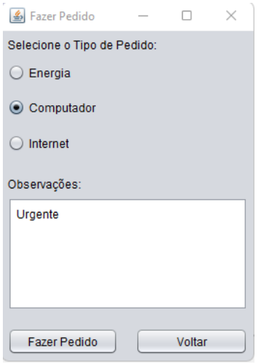
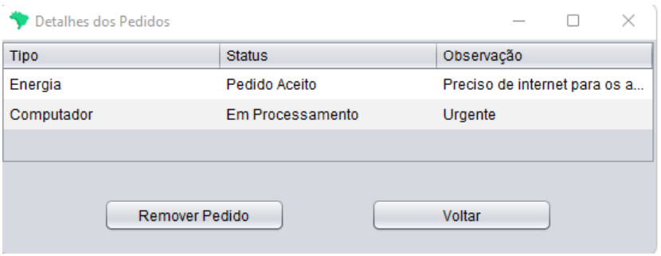
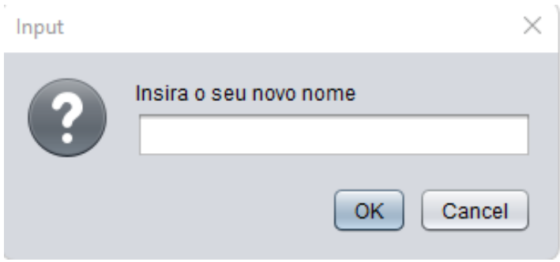
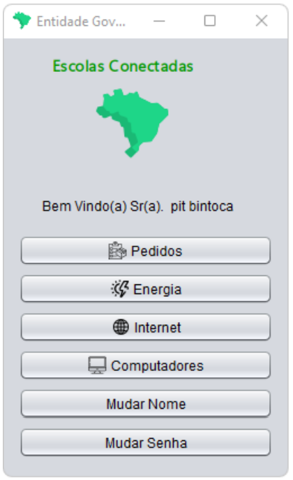
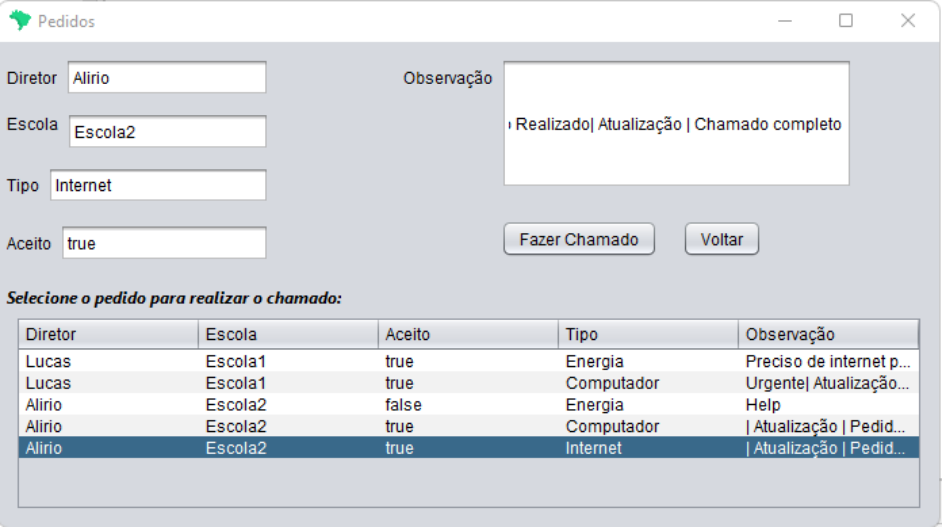
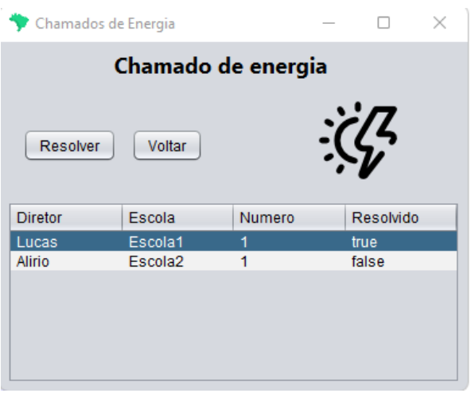

# 1. Objetivo do projeto

Nos últimos anos, foi possível notar a importância da tecnologia no processo da educaçãao dentro das
escolas. Ferramentas como vídeos educativos, jogos educacionais e ferramentas interativas já começaram a
surgir como opções que escolas e professores podem trazer para auxiliar o processo educativo e se mostraram
consideravelmente efetivas. Além disso, em luz dos eventos recentes, a abertura das escolas de forma remota durante a pandemia de COVID-19 tornou-se poss ́ıvel somente por meio da internet e das m ́ultiplas plataformas dispon ́ıveis nela (Ex. Google Classrom, Microsoft Teams, etc.). 
Dessa forma,  ́e possível perceber a importância crescente que essas tecnologias terão no processo educacional. Nessa luz, esse projeto tem como
objetivo fazer um sistema para o cadastramento e o auxílio de escolas públicas nos âmbitos de conectividade
e modernização. São oferecidos serviços em formatos de programas governamentais que oferecem internet,
energia e computadores através de pedidos feitos pela própria instituição.

# 2. Regra de negócio

## 2.1 Cadastro
No sistema serão cadastrados os usuarios que poderao fazer operacoes no sistema, cada usuario tera
um login unico e senha. Existem duas opcoes para realizar o cadastramento, a primeira e como entidade
governamental que tera um cargo e sua identificacao de funcionario, a segunda opcao e como diretor da
escola, este por sua vez deve cadastrar suas informacoes pessoais e a escola na qual ele coordena, o cadastro
do diretor no sistema so e possıvel se os dados da escola forem preenchidos. Entre os dados referentes a
escola sao importantes os dados referentes ao endereco da escola, e isso inclui sua geolocalizacao, numero de
computadores presentes, quantidade de alunos, se a escola possui conexao com a internet ou nao e se possui
energia eletrica.

## 2.2 Serviços
Uma vez feito o cadastro do diretor e da escola o diretor pode fazer o login no sistema com seus dados
cadastrados e dentro do sistema ele pode fazer ate 3 pedidos diferentes, independente da situacao da escola. O
pedido pode ser para solicitar conexao com internet, instalacao de energia eletrica ou ate computadores para
os alunos, no pedido nao sao observadas as condicoes da escola, ou seja, se a escola que esta solicitando internet
tem ou nao conexao. Alem disso, os diretores podem observar os pedidos que estao em processamento e os
pedidos que foram aprovados em uma pagina separada, bem como as observacoes associadas a ele. Pedidos
recusados pela entidade sao automaticamente excluıdos e e possıvel realizar somente um pedido de cada tipo,
sendo necessario excluir o pedido do tipo anterior caso deseje realizar um novo do mesmo tipo.

Ja a entidade governamental pode olhar a lista de pedidos feitos pelos diretores das escolas e pode tratar
cada pedido individualmente e mudar seu estado interno de nao apto para apto. A entidade deve verificar se
o pedido esta apto para ser aceito ou nao, so assim podera criar um chamado para a realizacao de um dos 3
servicos. E possıvel mudar o status da escola atraves da entidade do governo, assim que um pedido e aceito 
e o chamado e realizado, o status da escola deve ser mudado para se adequar a nova atualizacao realizada
pelo programa governamental. Os tres tipos de chamados sao:

* Servico de computadores: Tem como objetivo levar computadores para as escolas e existe uma
relacao entre o numero de computadores em relacao a quantidade de matrıculas, e uma condicao extra
e que a escola deve ter internet para o servico ser feito, caso nao tenha a entidade do governo deve
solicitar um novo chamado, porem para o servico de instalacao de internet na escola.

* Servico de internet: Tem como objetivo levar internet para a escola e tem como pre-requisito a escola
nao ter internet e possuir energia, caso nao possua, deve ser realizado um novo chamado.

* Servico de energia: Tem como objetivo levar energia a escola e tem como pre-requisito nao ter energia
na escola.

Por fim, como funcionalidade adicional e possıvel mudar o nome do usuario mostrado ao longo da aplicacao
e a senha, tanto para o diretor como para a entidade.
# 3. Diagrama de classe 
Trata-se de um projeto orientado a objetos portanto temos o seguinte diagrama de classes

   

# 4. Telas

## 4.1 Tela inicial

Primeira tela do programa, nela e possıvel acessar as telas de cadastro dos dois tipos de usuarios e entrar
no programa usando login e senhas cadastradas. Ao clicar no botao entrar o programa verifica a existˆencia
de algum tipo de usuario e senha que correspondem e assim 3 casos sao possıveis. O primeiro caso se da
quando a alguma informacao do login esteja errada ou nao exista algum usuario com aquele nome, nesse
caso o programa avisara. O segundo caso se da quando quem acessa o programa uma entidade do governo,
com isso esse usuario e direcionado a pagina inicial de entidades governamentais. Por ultimo o caso onde o
usuario que acessa e um diretor, esse e direcionado a pagina inicial de diretores.

   

## 4.2 Tela de cadastro
Tela do programa que realiza o cadastro da entidade governamental. Caso a alguma informacao do login
esteja errada ou exista um o usuario com mesmo login o usuario sera avisado. Todas as informacoes devem
ser preenchidas. Com todas as informacoes averiguadas essa entidade governamental sera adicionada ao nosso
banco de dados.

   

## 4.3 Tela inicial do diretor
Tela inicial do diretor, nela o nome do diretor que acessa o servico aparece no topo da pagina. Essa tela
da acesso tambem a tela de fazer pedidos, detalhes dos pedidos, mudar senha e mudar nome

   

## 4.4 Tela pedidos do diretor
Nessa tela o diretor pode realizar pedidos de 3 tipos, porem apenas 1 de cada tipo. O diretor seleciona
apenas um dos servicos que deseja, deixa sua observacao e realiza o pedido enviando para o banco de dados
do sistema

   

## 4.5 Tela detalhes do pedido do diretor
Tela em que o Diretor pode ver a lista de pedidos feitos, seus respectivos status e as respectivas observacoes.
Essa tela e feita para acompanhar os pedidos. Nela temos a opcao de excluir um pedido da lista de pedidos
ou apenas voltar para a tela anterior.

   

## 4.6 trocar senha ou nome de usuário
Em telas como essa podem ser feitas as mudancas de nome login e senha dos usuarios. Para isso o usuario
deve estar logado no sistema e basta informar o que esta sendo pedido e apertar no botao ”OK”, caso o
usuario desista basta clicar no botao ”Cancel”.

   

## 4.7 Tela inicial entidade
Tela inicial da entidade, nessa tela podemos acessar as tabelas de chamados de energia, internet e computadores realizados pelas entidades governamentais e pedidos feitos pelos diretores. Alem disso temos a opcao
de mudar o nome e senha de usuario no sistema, reescrevendo essas informacoes no banco de dados.

   

## 4.8 Tela de pedidos

Nessa tela podemos ver todos os pedidos feitos por todos os diretores e podemos gerenciar criando chamados com esses pedidos. Para criar chamados e preciso habilitar o botao ”Fazer Chamado” e para isso deve
ter um pedido da lista selecionada (por um clique de mouse em cima da linha do pedido), com o pedido
selecionado as informacoes referentes a esse pedido irao aparecer nos respectivos campos da pagina e sera
possıvel fazer a solicitacao de um chamado. Caso esse pedido ja tenha se tornado um chamado o campo
”Aceito” sera ”true”e nao sera possıvel realizar o chamado. A acao de fazer chamado atualizara as variaveis
de ”Aceito”e ”Observacao”na tela e no banco de dados

   

## 4.9 Tela de Chamado 
Nessa tela podemos ver todos os chamados feitos e temos a opcao de resolver os chamados, verificando
as informacoes da escola no sentido de energia eletrica, verificando assim se e viavel ou nao realizar esse
chamado. Para habilitar o botao de resolver e necessario selecionar um chamado na lista (clique na linha do
chamado), se o chamado for resolvido a variavel ”Resolvido”sera atualizada para ”true”e a observacao do
pedido sera atualizada.

   

